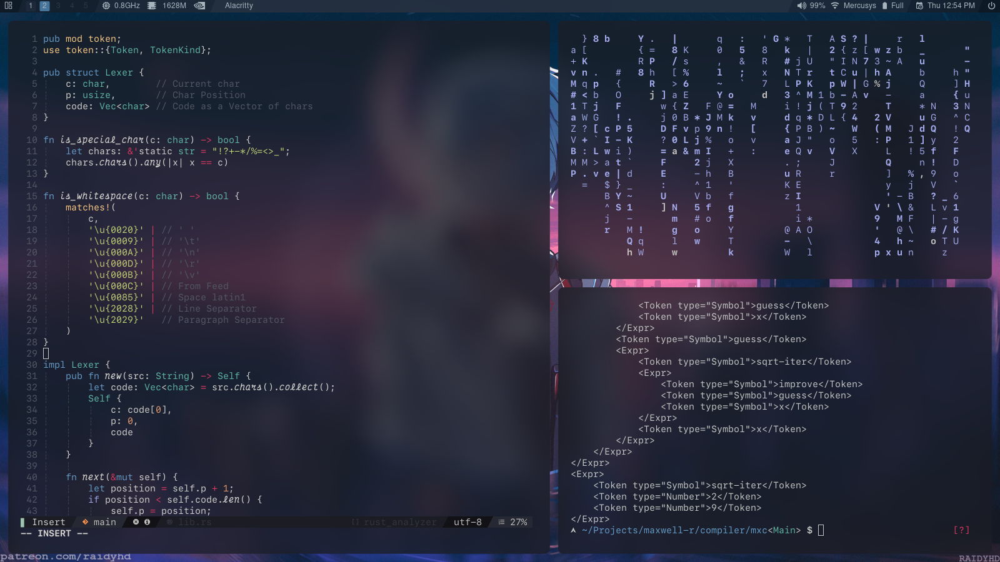
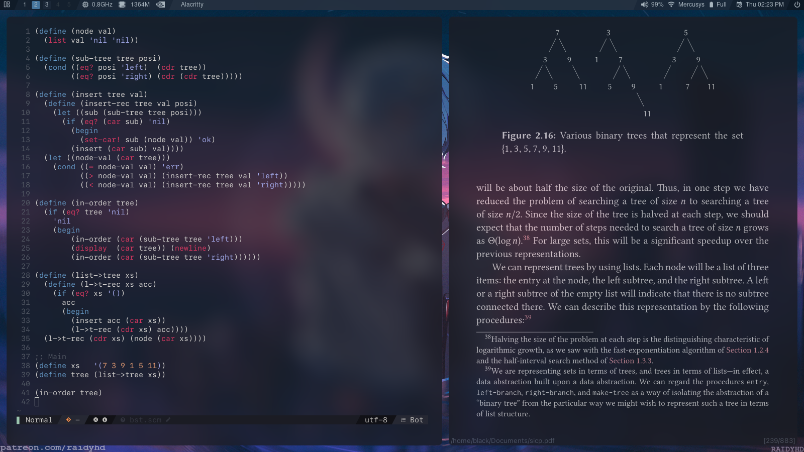

# .dotfiles
Just my personal dotfiles
## Setup

Clone this repository and execute the [symlinks](./symlinks.sh) script. The script will create all necessary directories and generate a symbolic link for each file.
The example below show how to clone and execute within the current user's home directory:

```bash
git clone https://github.com/Mth-Ryan/.dotfiles $HOME/.dotfiles
cd $HOME/.dotfiles
./symlinks.sh
```
The full setup will require some dependencies to work, the list with the main dependencies is at the [end of the README](#dependencies).

## Preview

---


## Dependencies
* [alacritty](https://github.com/alacritty/alacritty)
* [neovim](https://neovim.io/) 0.5^ (optional)
* [git](https://git-scm.com/)
* [pulseaudio](https://www.freedesktop.org/wiki/Software/PulseAudio/)
* [networkmanager](https://github.com/NetworkManager/NetworkManager)
* [zsh](https://www.zsh.org/)
* [python](https://www.python.org/)
* [pip](https://pypi.org/project/pip/)
* [psutil](https://pypi.org/project/psutil/)
* [qtile](http://www.qtile.org/)
* [picom](https://github.com/ibhagwan/picom/tree/next-rebase)
* [rofi](https://github.com/davatorium/rofi)
* [zathura](https://pwmt.org/projects/zathura/) (optional)
* [mupdf](https://mupdf.com/) (for zathura)
* [xclip](https://github.com/astrand/xclip) (optional)
