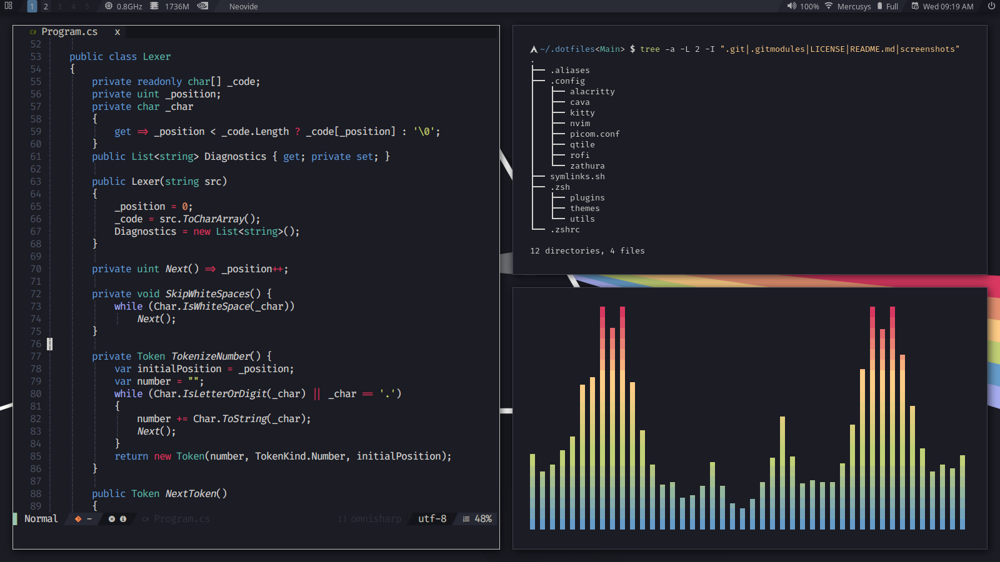

# .dotfiles
Just my personal dotfiles
## Setup

Clone this repository and execute the [symlinks](./symlinks.sh) script. The script will create all necessary directories and generate a symbolic link for each file.
The example below show how to clone and execute within the current user's home directory:

```bash
git clone https://github.com/Mth-Ryan/.dotfiles $HOME/.dotfiles
cd $HOME/.dotfiles
./symlinks.sh
```
The full setup will require some dependencies to work, the list with the main dependencies is at the [end of the README](#dependencies).

## Preview

---


## Dependencies
* [kitty](https://archlinux.org/packages/community/x86_64/kitty/)
* [neovim](https://archlinux.org/packages/community/x86_64/neovim/) 0.5^ (optional)
* [neovide](https://aur.archlinux.org/packages/neovide/) (optional)
* [git](https://archlinux.org/packages/extra/x86_64/git/)
* [pulseaudio](https://archlinux.org/packages/extra/x86_64/pulseaudio/)
* [pavucontrol](https://archlinux.org/packages/extra/x86_64/pavucontrol/)
* [networkmanager](https://archlinux.org/packages/extra/x86_64/networkmanager/)
* [zsh](https://archlinux.org/packages/extra/x86_64/zsh/)
* [bat](https://archlinux.org/packages/community/x86_64/bat/)
* [highlight](https://archlinux.org/packages/community/x86_64/highlight/)
* [lesspipe](https://archlinux.org/packages/community/any/lesspipe/)
* [python](https://archlinux.org/packages/core/x86_64/python/)
* [pip](https://archlinux.org/packages/extra/any/python-pip/)
* [psutil](https://archlinux.org/packages/community/x86_64/python-psutil/)
* [iwlib](https://archlinux.org/packages/community/x86_64/python-iwlib/)
* [xorg-xrandr](https://archlinux.org/packages/extra/x86_64/xorg-xrandr/)
* [qtile](https://archlinux.org/packages/community/x86_64/qtile/)
* [picom](https://archlinux.org/packages/community/x86_64/picom/)
* [rofi](https://archlinux.org/packages/community/x86_64/rofi/)
* [nitrogen](https://archlinux.org/packages/extra/x86_64/nitrogen/)
* [papirus-icon-theme](https://archlinux.org/packages/community/any/papirus-icon-theme/)
* [nerd-fonts-fira-code](https://aur.archlinux.org/packages/nerd-fonts-fira-code/)
* [apple-fonts](https://aur.archlinux.org/packages/apple-fonts/)
* [lxappearance](https://archlinux.org/packages/community/x86_64/lxappearance/)
* [feh](https://archlinux.org/packages/extra/x86_64/feh/) (optional)
* [thunar](https://archlinux.org/packages/extra/x86_64/thunar/) (optional)
* [zathura](https://archlinux.org/packages/community/x86_64/zathura/) (optional)
* [zathura-pdf-mupdf](https://archlinux.org/packages/community/x86_64/zathura-pdf-mupdf/) (optional)
* [xclip](https://archlinux.org/packages/extra/x86_64/xclip/) (optional)
* [cava](https://aur.archlinux.org/packages/cava/) (optional)
* [yay](https://aur.archlinux.org/yay/) (optional, Arch only)
* [go](https://archlinux.org/packages/community/x86_64/go/) (optional, yay dependencie)

To install All dependencies on [Arch Linux](https://archlinux.org/) just follow this steps:

First you will need an Aur helper to install Cava and Neovide more easily, yay is a good option.

```bash
sudo pacman -S git go base-devel # dependecies 
cd /tmp && git clone https://aur.archlinux.org/yay.git
cd yay && makepkg -i # make sure your user belongs to the wheel group
```

After yay installation, you can simply get all dependencies with the command bellow:

```bash
yay -S --needed --nodiffmenu --removemake kitty neovim pulseaudio pavucontrol networkmanager zsh bat highlight lesspipe python python-iwlib python-psutil xorg-xrandr qtile picom rofi nitrogen nerd-fonts-fira-code apple-fonts lxappearance thunar feh papirus-icon-theme zathura zathura-pdf-mupdf xclip neovide-git cava
```

Use nitrogen to set the wallpaper and acticvate the pulseaudio deamon with this command:

```bash
systemctl --user enable pulseaudio 
```
